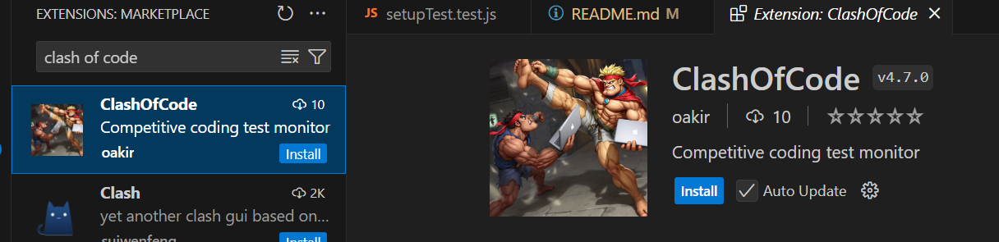

# Ping Pong Chat : a ChatGPT-like Application 

Bienvenue dans le projet fil rouge pour notre cours sur l'architecture et les bonnes pratiques de développement.

## Prérequis

- Node.js (v18 ou supérieur)
- npm
- Git
- VS Code 
- Clash of code ( vs code extension )


## Installation

1. **Cloner le dépôt**
```
git clone https://github.com/akiroussama/pingpongchat
cd pingpongchat
```

2. **Installer les dépendances**

```
npm install
```

3. **Lancer l'application**

```
npm run dev
```
4. Tests

```
npm run test
```
## liens utiles

Vitest Documentation : https://vitest.dev/

Express.js Documentation : https://expressjs.com/fr/

Node.js Documentation : https://nodejs.org/fr/docs/


## **Explication du déroulement de l'après-midi avec des tests Vitest **
Pour cet après-midi, nous allons travailler sur le projet **pingpongchat** en utilisant des tests **Vitest** qui passeront au
vert une fois que vous aurez apporté de **petites modifications** au code 

**Voici les étapes à suivre :**
---
### **1. Cloner le dépôt **
Commencez par cloner le dépôt GitHub du projet avec la commande suivante dans votre terminal :
```bash
git clone https://github.com/akiroussama/pingpongchat
```
---
### **2. Utilisez VSCode **
Assurez-vous d'utiliser **Visual Studio Code (VSCode)** pour ce projet. Si vous ne l'avez pas encore, téléchargez-le et
installez-le depuis le site officiel :
 [Télécharger VSCode](https://code.visualstudio.com/)

---
### **3. Installez l'extension VSCode 'Clash of Code' **
Dans VSCode, rendez-vous dans le gestionnaire d'extensions (**CTRL + SHIFT + X**) et installez l'extension nommée
**Clash of Code**. Cette extension est essentielle pour notre activité ! 

---
### **4. Installez les dépendances du projet **
Ouvrez un terminal dans VSCode (**Terminal > Nouveau terminal**) et exécutez la commande suivante pour installer
toutes les dépendances nécessaires :
```bash
npm install
```
---
### **5. Démarrez le mode 'Clash of Code' **
Appuyez sur **CTRL + P** pour ouvrir la palette de commandes de VSCode, puis tapez et sélectionnez :
```
Start Clash of Code Watch Mode
```
> **Astuce :** Cette commande permettra d'envoyer votre progression en **temps réel** (sans votre accord... ), de
l'enregistrer dans une base de données, et de l'afficher ensuite dans une application frontend sous forme de 
 **course de voitures** ! 🚗💨  
> *Note : Le choix de la voiture n'est pas encore disponible dans cette version. Patience, ça arrive ! 😉*

---

### **6. Résolvez les tests qui échouent (Phase GREEN) 🟢**

À chaque étape, vous trouverez des tests **Vitest** qui échouent ❌. Votre mission, si vous l'acceptez, est de **modifier le code** pour que ces tests passent au **vert** ✅ !

🔥 **Challenge Accepted ?**

---

### **7. Refactorez si nécessaire ♻️**

Une fois que les tests passent, vous pouvez **améliorer** ou **nettoyer** votre code. Le **refactoring** est une excellente pratique pour maintenir un code propre, lisible et efficace. ✨

---

### **8. Gagnez un badge spécial 🏆**

Le **premier** à terminer toutes les étapes et à faire passer tous les tests au vert recevra un **badge spécial** ! 🎖️

Étant donné que le jeu s'appelle **'Clash of Code'**, nous vous proposons de nommer ce badge :

🌟 **"Maître du Clash"** ou **"Code Ninja"** 🥷

---

## **En résumé, vous allez :**

1. **Cloner** le projet et préparer votre environnement de travail. 🖥️
2. **Résoudre des tests unitaires** en modifiant le code source. 🧩
3. **Voir votre progression en temps réel** grâce à l'extension **'Clash of Code'**. 📡
4. **Compétitionner amicalement** avec vos camarades pour gagner un **badge spécial**. 🤝

---

### **Pourquoi participer ?**

Cette activité est conçue comme un **terrain de jeu interactif** pour améliorer vos compétences en développement et en résolution de problèmes, tout en vous **amusant** ! 🎉

C'est l'occasion parfaite pour :

- Affûter vos compétences en **JavaScript** 🔪
- Apprendre à écrire et corriger des **tests unitaires** 🧪
- Collaborer et **apprendre les uns des autres** 🤗
- Et surtout, **passer un bon moment** ensemble ! 😄

---

**Bonne chance à tous, et que le code soit avec vous !** 🚀

Si vous avez des questions, n'hésitez pas à me les poser. Je suis là pour vous aider ! 🙌

---

✨ **Let's Clash and Code!** ✨
